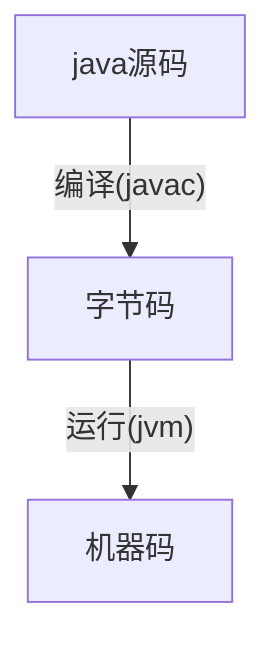
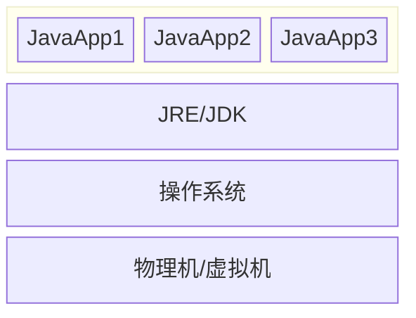
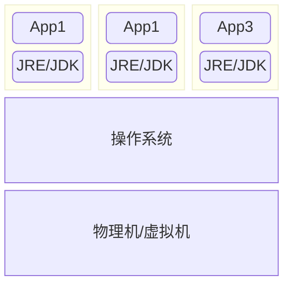
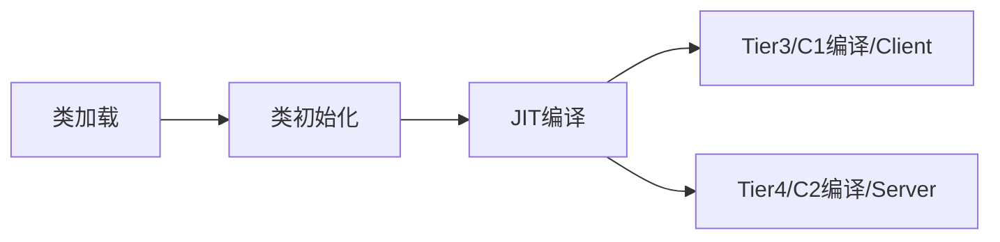
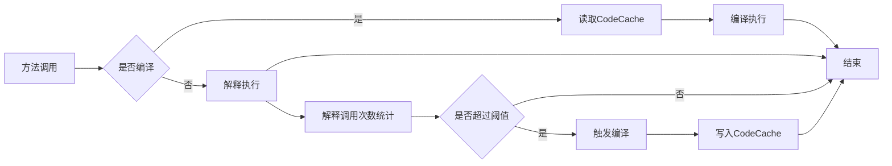
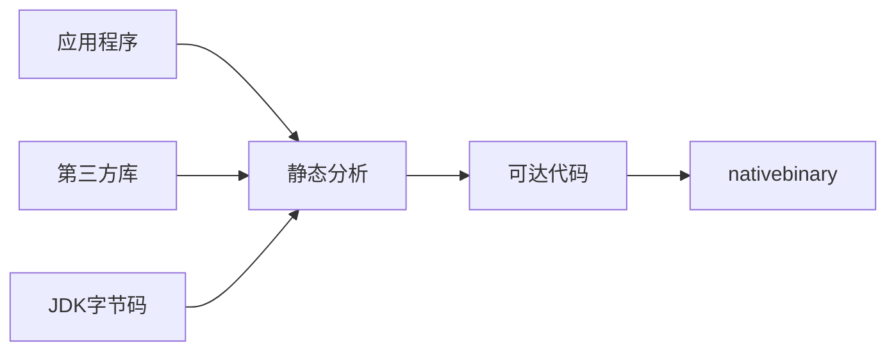
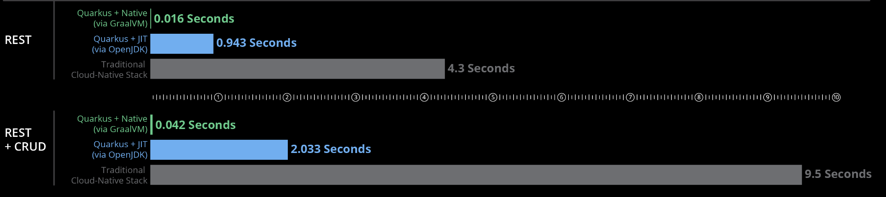
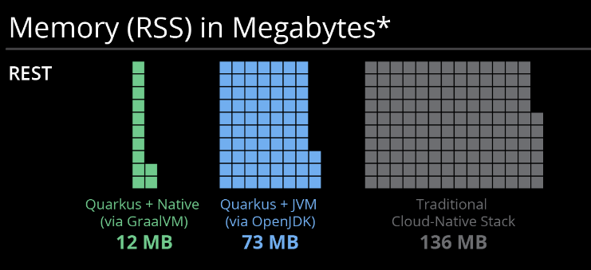

# About This Project

## 演示SpringBoot Native Image

### Dependencies
    - GraalVM 21
    - Visual Studio 2022
      - C++桌面开发工具/MSVC V143 
    - SpringBoot 3.2.0
    - mybatis-spring-boot-starter 3.0.3
      
### NativeImage 打包
```
mvn -Pnative -DskipTests package
```

### 可能遇到的问题

1. Please specify class (or <module>/<mainclass>) containing the main entry point    
   ~~native-maven-plugin中指定mainClass~~
    SpringBoot 版本问题，3.2.0解决

2. Error: On Windows, GraalVM Native Image for JDK 21 requires Visual Studio 2022 version 17.1.0 or later (C/C++ Optimizing Compiler Version 19.31 or later).   
   注意visual studio中 c++桌面开发包版本；另外如果安装了多个visual studio版本，一定要注意编译过程中实际用的是哪个版本

3. native-image building on Windows currently only supports target architecture: AMD64   
   visual studio installer中把中文语言包去掉，只保留英文

4. java.lang.ClassNotFoundException: com.mysql.jdbc.Driver
   在reflect-config.json中增加下列配置
```
{
        "name": "com.mysql.jdbc.Driver",
        "methods":
        [
            {
                "name": "<init>",
                "parameterTypes":
                []
            }
        ]
    },
```

5. mapper bean 没有被初始化， 出现空指针错误   
   @Resource注解改成 @Autowired注解
   

----------------------------------------------

# About Spring Native Image 

### 传统的Java应用
- 编译和运行过程


- 这个时候部署架构是这样的


优点：
- 一次编译，到处运行
    * JRE 解释和执行, 并抹平不同操作系统的差异
- 一个jdk/jre可以运行多个java实例

缺点：
+ 漫长初始启动时间
+ 庞大的内存消耗

### 云原生时代的Java应用



- 云原生时代的应用以容器为单位进行管理
- 容器是不能修改的(image创建好了之后Platform就已经确定了)

***看起来不太合理***： 每个容器都是需要打包一个jre进去
- 根源：bytecode只能被jvm执行，即使最简单的HelloWorld
- 对比其他语言，java的容器镜像会占用更多的额外空间

- 除此之外， 也会需要更多的启动时间和运行内存
1. 启动时间
- JVM启动和初始化

- jvm的解释执行和编译执行



- 所有的class在启动时就要被初始化和加载
- JIT 把执行最多的bytecode编译成机器码
    - client compiler/C1: 启动时间快, 桌面应用/applet
    - server compiler/C2: 性能高, 长时间运行的服务端应用

2. 内存占用
    - JVM： 一个完整的解释器、一个JIT编译器以及一个垃圾回收器
    - 对象： class meta，object meta
    - GC
    - 反射和框架
```
一个空的Spring Web内存占用约为122MB左右，作为对比，一个golang的Web应用在10MB左右
```

***但是*** 云原生恰恰需要的是：快速灵活的启动、销毁

### 如何应对？ AOT/Native Image/GraalVM

1. AOT
   在编译期直接将bytecode编译成machinecode， 使java程序像native程序一样不依赖于jre就能够运行
```
AOT在不同的场景有不同的含义， 这里我们先限定在Java（GraalVM）的世界
```

2. Native Image
   没有了JVM， Substrate VM来代替
- 内存管理（GC）
- 线程调度
- JNI 支持
- Exception

### GraalVM优势
+ 构建阶段, 生成可直接运行的本地代码

```
编译时已保存初始化好的堆快照
```
- 超快的启动时间
  
+ 运行阶段
    - 降低内存占用   
      

      


- 降低CPU占用
- 在启动时即可达到峰值性能，不需要预热时间


#### 本项目作为对比：

| Mode | Binary大小  | 启动时间   | 内存占用 |
|--------|-----------|--------|------|
| JVM | 25M (JAR) | 2.044s | 195M |
| Native | 100MB     | 0.098s | 58MB |


### 功能有何区别
有些功能需要特别进行配置
- 动态类加载：编译期需要对动态加载的类进行声明
- 反射：支持反射的类、方法、成员变量需要提前声明
- 动态代理：支持动态代理的interface需要提前声明
- JNI：需要提前声明.
- 序列化：需要提前声明(需要class metadata)

不再兼容的功能：
- InvokeDynamic 太过于动态了
- Security manager
- 只能使用调试


### native-image

#### 安装
- https://build-native-java-apps.cc/introduction/installation/
    - GraalVM 21
    - VisualStudio2022 with C++ Desktop Dev Toolkits
    - Maven 3.9.5

#### 基础用法
- https://build-native-java-apps.cc/native-image/

#### 反射
- 能够被native-image自动识别的反射API
    - Class.forName、Class.getMethod...
- 需要编译期声明的反射
    - -H:ReflectionConfigurationFiles=./reflect-config.json
    - reflect-config.json
```json
[
  {
    "name": "java.lang.String",
    "methods": [
      {
        "name": "toUpperCase",
        "parameterTypes": []
      }
    ]
  }
]
```

#### 类初始化
- 默认：尽可能在编译时就完成尽可能多的类初始化
```
private static final int SOME_STATIC_VAR = ThreadLocalRandom.current().nextInt(100);
```
- 可以通过配置设置那些包或者类在哪个阶段进行初始化
```
--initialize-at-build-time
--initialize-at-run-time

如果一个类在编译的时候进行初始化，那么它所有的父类也要在编译阶段完成初始化
如果一个类在运行阶段进行初始化，那么它所有的子类也必须在运行阶段完成初始化
```


#### 动态代理
- 自动识别
```
java.lang.reflect.Proxy.newProxyInstance(ClassLoader, Class<?>[], InvocationHandler)
java.lang.reflect.Proxy.getProxyClass(ClassLoader, Class<?>[])
```
- 配置指定
```
[
  {
    "interfaces": ["java.util.concurrent.Callable"]
  }
]

```
#### 资源文件
- 自动识别
```
Class.getResource()
Class.getResourceAsStream()
ClassLoader.getResource()
ClassLoader.getResourceAsStream()
ClassLoader.getResources()
```
- 配置指定
```
{
  "resources": {
    "includes": [
      {
        "pattern": "input.txt"
      }
    ]
  }
}

```

#### 序列化
- 指定哪些类需要序列化支持
```
[
  {
    "name": "com.example.MyClass"
  }
]
```

#### native-image自动识别以下配置文件
|配置文件|	描述	|
|---|---|
jni-config.json	|JNI|	
predefined-classes-config.json	| predefined class
proxy-config.json|		Dynamic proxy|
reflect-config.json	|	Reflection|
resource-config.json|		Resources	|
serialization-config.json	|	Serialization	|	

### 怎么在实际项目中用起来

+ 关键：第三方库是不是支持， 怎么实现支持
+ 有一些已经支持， netty
+ 对于不支持的lib
    - 自己改
    - 用框架 Quarkus/Micronaut/SpringNative

#### Quarkus
针对 Java 虚拟机 (JVM) 和本机编译的全栈 Kubernetes 本地 Java 框架，专门针对容器优化 Java ，使其成为无服务器，云和 Kubernetes 环境的有效平台。


### 性能测试

- 基础环境
  + TestTool: apache bench
  + Hardware: 13900HX/32G
  + 场景
    - 1000并发百万次查询(mysql中读取提一条记录)
  + 结果对比

| Mode   | 总耗时(s)    | 平均响应时间(s)    | RPS(req/s) | 最长响应时间(ms) | rt90(ms) | rt95(ms) | rt99(ms)     |
|--------|-----------|-------------------|------------|----------------|----------|----------|--------------|
| JVM    | 110.85    | 110.85            | 9020       | 7289           | 93       | 1049     | 1110         |                    |
| Native | 98.87     | 98.87             | 10114      | 7255           | 36       | 1044     | 1086         |                   |

    - Native 启动时间和吞吐占优， RT90优势明显

- 服务端CPU占用对比


    - hotspot 预热阶段需要大量的编译工作，需要占用更多的CPU
    - graalvm CPU占用平缓，但是长时间运行的时候并不占优势

- 服务端MEM占用对比

    - graalvm 内存占用优势遥遥领先
  
- ab测试结果详情
```
native模式
-----------------------------------------------

ab -n 1000000 -c 1000 http://172.19.80.1:8081/api/demo/case1
This is ApacheBench, Version 2.3 <$Revision: 1879490 $>
Copyright 1996 Adam Twiss, Zeus Technology Ltd, http://www.zeustech.net/
Licensed to The Apache Software Foundation, http://www.apache.org/

Benchmarking 172.19.80.1 (be patient)
Completed 100000 requests
Completed 200000 requests
Completed 300000 requests
Completed 400000 requests
Completed 500000 requests
Completed 600000 requests
Completed 700000 requests
Completed 800000 requests
Completed 900000 requests
Completed 1000000 requests
Finished 1000000 requests


Server Software:
Server Hostname:        172.19.80.1
Server Port:            8081

Document Path:          /api/demo/case1
Document Length:        441 bytes

Concurrency Level:      1000
Time taken for tests:   98.871 seconds
Complete requests:      1000000
Failed requests:        0
Total transferred:      546000000 bytes
HTML transferred:       441000000 bytes
Requests per second:    10114.15 [#/sec] (mean)
Time per request:       98.871 [ms] (mean)
Time per request:       0.099 [ms] (mean, across all concurrent requests)
Transfer rate:          5392.89 [Kbytes/sec] received

Connection Times (ms)
              min  mean[+/-sd] median   max
Connect:        0   86 311.3      1    7233
Processing:     1   13   8.6     10     131
Waiting:        1   12   8.5     10     130
Total:          1   98 313.1     11    7255

Percentage of the requests served within a certain time (ms)
  50%     11
  66%     14
  75%     18
  80%     21
  90%     36
  95%   1044
  98%   1067
  99%   1086
 100%   7255
```

```
jar模式
-----------------------------------------------

(base) zongkuiy@DESKTOP-9NSDSJC:~$ ab -n 1000000 -c 1000 http://172.19.80.1:8081/api/demo/case1
This is ApacheBench, Version 2.3 <$Revision: 1879490 $>
Copyright 1996 Adam Twiss, Zeus Technology Ltd, http://www.zeustech.net/
Licensed to The Apache Software Foundation, http://www.apache.org/

Benchmarking 172.19.80.1 (be patient)
Completed 100000 requests
Completed 200000 requests
Completed 300000 requests
Completed 400000 requests
Completed 500000 requests
Completed 600000 requests
Completed 700000 requests
Completed 800000 requests
Completed 900000 requests
Completed 1000000 requests
Finished 1000000 requests


Server Software:
Server Hostname:        172.19.80.1
Server Port:            8081

Document Path:          /api/demo/case1
Document Length:        441 bytes

Concurrency Level:      1000
Time taken for tests:   110.856 seconds
Complete requests:      1000000
Failed requests:        0
Total transferred:      546000000 bytes
HTML transferred:       441000000 bytes
Requests per second:    9020.71 [#/sec] (mean)
Time per request:       110.856 [ms] (mean)
Time per request:       0.111 [ms] (mean, across all concurrent requests)
Transfer rate:          4809.87 [Kbytes/sec] received

Connection Times (ms)
              min  mean[+/-sd] median   max
Connect:        0   79 321.4      1    7241
Processing:     1   31  26.3     21     230
Waiting:        1   30  26.3     20     230
Total:          2  110 322.7     24    7289

Percentage of the requests served within a certain time (ms)
  50%     24
  66%     40
  75%     52
  80%     61
  90%     93
  95%   1049
  98%   1087
  99%   1110
 100%   7289
```


