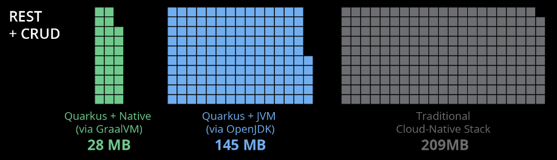
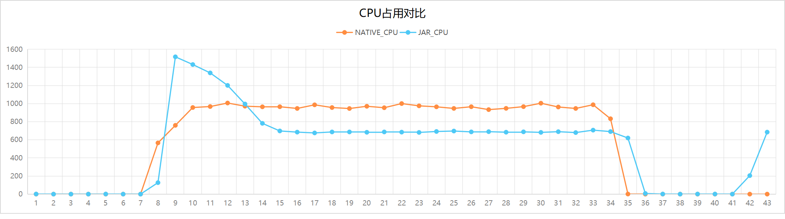
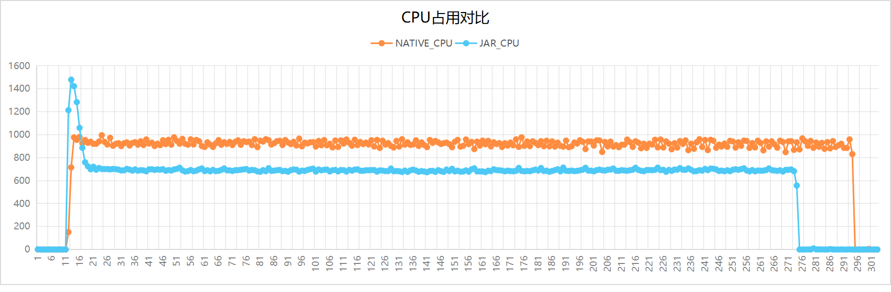
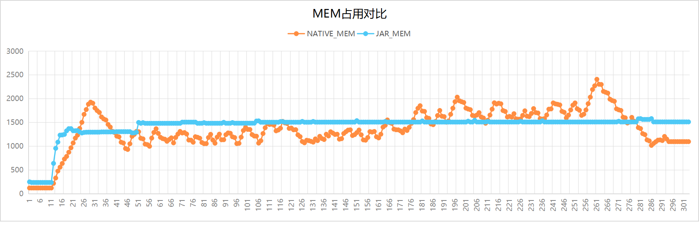
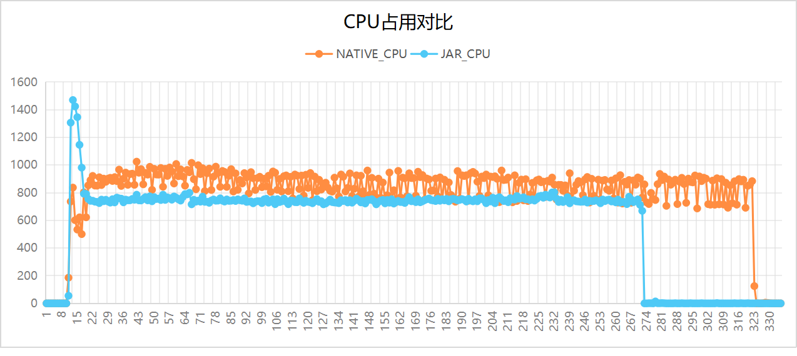
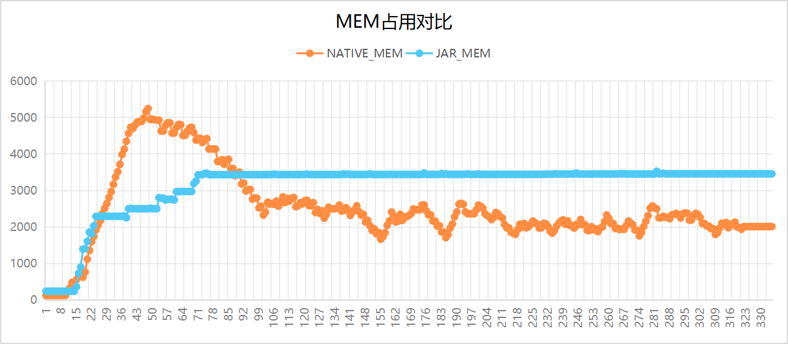

# This Project

> 演示SpringBoot Native Image 的编译、配置和相关测试

### Dependencies
    GraalVM 21
    Win: Visual Studio 2022/C++桌面开发工具/MSVC V143 
    Ubuntu: gcc/glibc-devel/zlib-devel
    SpringBoot 3.2.0
    mybatis-spring-boot-starter 3.0.3
      
### NativeImage 打包
```
mvn -Pnative -DskipTests package
```

### 可能遇到的问题

1. Please specify class (or <module>/<mainclass>) containing the main entry point    
   >~~native-maven-plugin中指定mainClass~~
    SpringBoot 版本问题，3.2.0解决

2. Error: On Windows, GraalVM Native Image for JDK 21 requires Visual Studio 2022 version 17.1.0 or later (C/C++ Optimizing Compiler Version 19.31 or later).   
   > 注意visual studio中 c++桌面开发包版本；另外如果安装了多个visual studio版本，一定要注意编译过程中实际用的是哪个版本

3. native-image building on Windows currently only supports target architecture: AMD64   
   > visual studio installer中把中文语言包去掉，只保留英文

4. java.lang.ClassNotFoundException: com.mysql.jdbc.Driver
   > 在reflect-config.json中增加下列配置
    ```
    {
            "name": "com.mysql.jdbc.Driver",
            "methods":
            [
                {
                    "name": "<init>",
                    "parameterTypes":
                    []
                }
            ]
        },
    ```

5. mapper bean 没有被初始化， 出现空指针错误   
    > 参考[issue #29614](https://github.com/spring-projects/spring-framework/issues/29614)   
    将@Resource注解改成 @Autowired注解
   

----------------------------------------------

# Spring Native Image 

### 传统的Java应用
- 编译和运行过程


- 这个时候部署架构是这样的


优点：
+ 一次编译，到处运行
    * JRE 解释和执行, 并抹平不同操作系统的差异
+ 一个jdk/jre可以运行多个java实例

缺点：
+ 漫长初始启动时间
+ 庞大的内存消耗


### 云原生时代的Java应用


- 云原生时代的应用以容器为单位进行管理
- 容器无法修改

***看起来不太合理***： 每个容器都是需要打包一个jre进去
- 根源：bytecode只能被jvm执行，即使最简单的HelloWorld
- 对比其他语言，java的容器镜像会占用更多的额外空间

- 除此之外， 也会需要更多的启动时间和运行内存
1. 启动时间
- JVM启动和初始化

- jvm的解释执行和编译执行


- 所有的class在启动时就要被初始化和加载
- JIT 把执行最多的bytecode编译成机器码
    - client compiler/C1: 启动时间快, 桌面应用/applet
    - server compiler/C2: 性能高, 长时间运行的服务端应用

2. 内存占用
    - JVM： 一个完整的解释器、一个JIT编译器以及一个垃圾回收器
    - 对象： class meta，object meta
    - GC
    - 反射和框架
```
一个空的Spring Web内存占用约为100MB左右，作为对比，一个golang的Web应用在10MB左右
```

***但是*** 云原生恰恰需要的是：快速灵活的启动、销毁

### 如何应对？ AOT/Native Image/GraalVM

1. AOT
   在编译期直接将bytecode编译成machinecode， 使java程序像native程序一样不依赖于jre就能够运行
```
AOT在不同的场景有不同的含义， 这里我们先限定在Java世界
```

2. GraalVM 的 Native Image   
没有了JVM， Substrate VM来代替
- 内存管理（GC）
- 线程调度
- JNI 支持
- Exception

### GraalVM优势
+ 构建阶段, 生成可直接运行的本地代码

```
编译时已保存初始化好的堆快照
```
- 超快的启动时间
  
+ 运行阶段
    - 降低内存占用   
      

      


- 降低CPU占用
- 在启动时即可达到峰值性能，不需要预热时间

### 功能有何区别
有些功能需要特别进行配置
- 动态类加载：编译期需要对动态加载的类进行声明
- 反射：支持反射的类、方法、成员变量需要提前声明
- 动态代理：支持动态代理的interface需要提前声明
- JNI：需要提前声明.
- 序列化：需要提前声明(需要class metadata)

不再兼容的功能：
- InvokeDynamic 太过于动态了
- Security manager
- 只能使用调试


### native-image

#### 安装
- https://www.graalvm.org/latest/docs/getting-started/
    - GraalVM 21
    - VisualStudio2022 with C++ Desktop Dev Toolkits
    - Maven 3.9.5

#### 基础用法
- https://www.graalvm.org/latest/reference-manual/native-image/

#### 反射
- 能够被native-image自动识别的反射API
    - Class.forName、Class.getMethod...
- 需要编译期声明的反射
    - -H:ReflectionConfigurationFiles=./reflect-config.json
    - reflect-config.json
```json
[
  {
    "name": "java.lang.String",
    "methods": [
      {
        "name": "toUpperCase",
        "parameterTypes": []
      }
    ]
  }
]
```

#### 类初始化
- 默认：尽可能在编译时就完成尽可能多的类初始化
```
private static final int SOME_STATIC_VAR = ThreadLocalRandom.current().nextInt(100);
```
- 可以通过配置设置那些包或者类在哪个阶段进行初始化
```
--initialize-at-build-time
--initialize-at-run-time

如果一个类在编译的时候进行初始化，那么它所有的父类也要在编译阶段完成初始化
如果一个类在运行阶段进行初始化，那么它所有的子类也必须在运行阶段完成初始化
```


#### 动态代理
- 自动识别
```
java.lang.reflect.Proxy.newProxyInstance(ClassLoader, Class<?>[], InvocationHandler)
java.lang.reflect.Proxy.getProxyClass(ClassLoader, Class<?>[])
```
- 配置指定
```
[
  {
    "interfaces": ["java.util.concurrent.Callable"]
  }
]

```
#### 资源文件
- 自动识别
```
Class.getResource()
Class.getResourceAsStream()
ClassLoader.getResource()
ClassLoader.getResourceAsStream()
ClassLoader.getResources()
```
- 配置指定
```
{
  "resources": {
    "includes": [
      {
        "pattern": "input.txt"
      }
    ]
  }
}

```

#### 序列化
- 指定哪些类需要序列化支持
```
[
  {
    "name": "com.example.MyClass"
  }
]
```

#### 推荐的配置文件描述
|配置文件|	描述	|
|---|---|
jni-config.json	|JNI|	
predefined-classes-config.json	| predefined class
proxy-config.json|		Dynamic proxy|
reflect-config.json	|	Reflection|
resource-config.json|		Resources	|
serialization-config.json	|	Serialization	|	

### 怎么在实际项目中用起来

> 关键：第三方库是不是支持
  + 有一些类库官方已经支持， eg. netty
    - native-image.properties
  + 对于不支持的库
    - 自己改
    - 用框架 Quarkus/Micronaut/Spring Native

#### Quarkus
TBD
#### Micronaut
TBD
#### Spring Native
本项目

### 性能测试(Native VS JVM)

- 基础环境
  + TestTool: apache bench
  + Hardware: 
    + Ubuntu22-x64 i7-12700K/32G
  + 静态对比

| Mode | Binary大小  | 启动时间   | 初始启动内存占用 | 编译时间 |
|--------|-----------|--------|---------|------|
| JVM | 26M (JAR) | 1.336s | 242M    | 2.8s |
| Native | 104M     | 0.075s | 125M    | 70s  |
    - 17x 启动时间提升
    - 内存占用减少为原来的50%

  + 性能对比
#### scenario 1: 1000并发, 共100w次, tomcat最大线程数2000
  
| Mode   | 总耗时(s)    | 平均响应时间(s)  | RPS(req/s) | 最长响应时间(ms) | rt90(ms) | rt95(ms) | rt99(ms)     |
|--------|-----------|-----------------|------------|----------------|----------|----------|--------------|
|JVM	|27.267|	27.267	|36674	|2048|	28|	30	|36|
|Native	|26.898|	26.898|	37177.37|	2743|	17	|20|	1026|

##### CPU 对比

##### Mem 对比


#### scenario 2: 2000并发, 共1kw次, tomcat最大线程数2000

| Mode   | 总耗时(s)    | 平均响应时间(s)  | RPS(req/s) | 最长响应时间(ms) | rt90(ms) | rt95(ms) | rt99(ms)     |
|--------|-----------|-----------------|------------|----------------|----------|----------|--------------|
|JVM	|263.155	|52.631	|38000.36	|2799	|58|61	|	68|
|Native	|282.723	|56.545	|35370.25	|14240	|42	|48|	1057|


##### CPU 对比


##### Mem 对比


#### scenario 3: 5000并发, 共1kw次, tomcat最大线程数2000

| Mode   | 总耗时(s)   | 平均响应时间(s)  | RPS(req/s) | 最长响应时间(ms) | rt90(ms) | rt95(ms) | rt99(ms)     |
|--------|------------|-----------------|------------|----------------|----------|----------|--------------|
|JVM	|261.439	|130.719	|38249.89	|7718	|145	|151	|166|
|Native	|312.032	|156.016	|32048.03	|58936	|131	|1077	|2111|

##### CPU 对比


##### Mem 对比


#### 性能测试结论
- Native 启动时间和内存占用优势遥遥领先
- JVM前期的解释执行工作和预热阶段的编译工作，需要占用更多的CPU
- Native CPU占用平缓，但是长时间运行的时候并不占优

  
#### ab测试结果详情
- 测试数据记录：请查看performance目录

> 测试注意事项
```
1. 如果是 Linux 环境，注意增大‘用户可以打开文件的最大数目’(ulimit -n)
2. 增大 Tomcat 线程池默认线程数
    server.tomcat.threads.max = 2000
3. 如果使用 Intel CPU 的 PC 进行测试，最好关闭小核
4. jstack会导致native image进程崩溃
```


### 总结
#### 比较明显的优势
- 更小的镜像空间占用
- 更少的内存占用
- 更少的启动时间
- 更快进入峰值性能

#### 劣势
- 需要更长的编译时间
- 第三方库的支持比较差
- 不支持交叉编译
- 使用动态特性时需要特别考虑


### 后续
#### SpringNative优化
+ 使用G1GC提升吞吐量
+ 开启PGO优化(基于程序特征的优化)
+ 开启CPU选项-march=native(GCC针对目标架构的优化)

#### Quarkus
+
#### Micronaut
+
